
 <b>Important Note: </b>For the test purpose to get these screenshots, i decrease the round block from 20000 to 20, to test faster. That means the lottery go second round on 20blocks, ends in block number 40 and new lottery starts. Original contract deployed is in lottery.html file. 
   
<ul>
  <li>
    <b>Deployment of the conract real contract:</b>    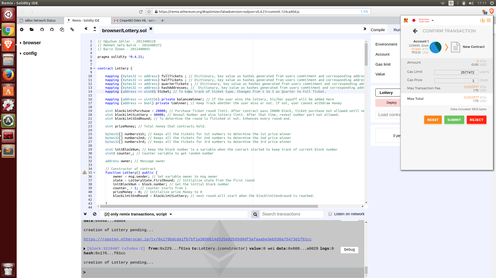   
  </li>
  <li>
    <b>Click buy option for half ticket:</b>    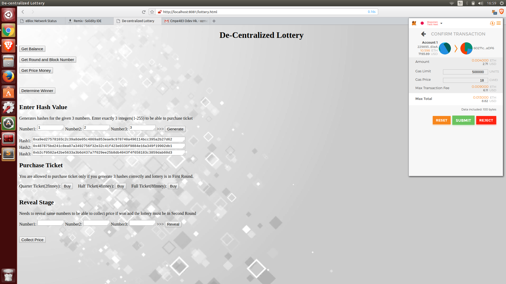   
  </li>
  <li>
    <b>Transcript of successful purchase:</b>       
  </li>
  <li>
    <b>Purchase tickets with 5 different accounts(Balance = 30 finneys):</b>    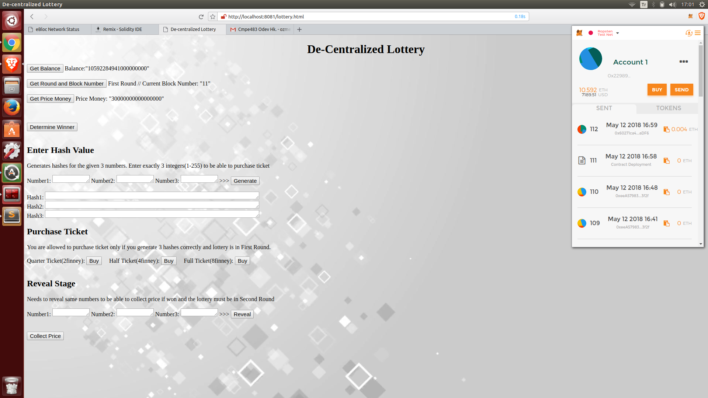   
  </li>
  <li>
    <b>Other Accounts:</b>    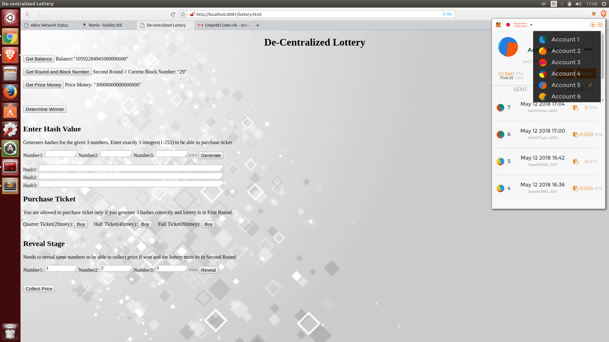   
  </li>
  <li>
    <b>Revealing the number 1, 2, 3 for each user:</b>    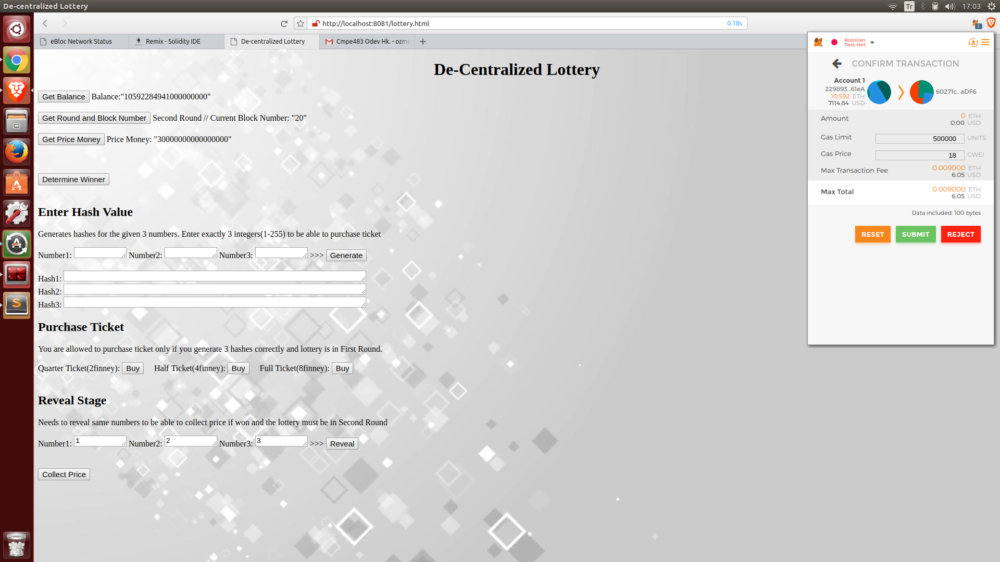   
  </li>
  <li>
    <b>Transcript of successful reveal:</b>    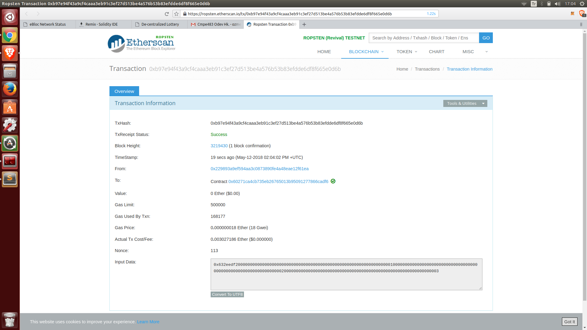   
  </li>
  <li>
    <b>Determining the winner:</b>    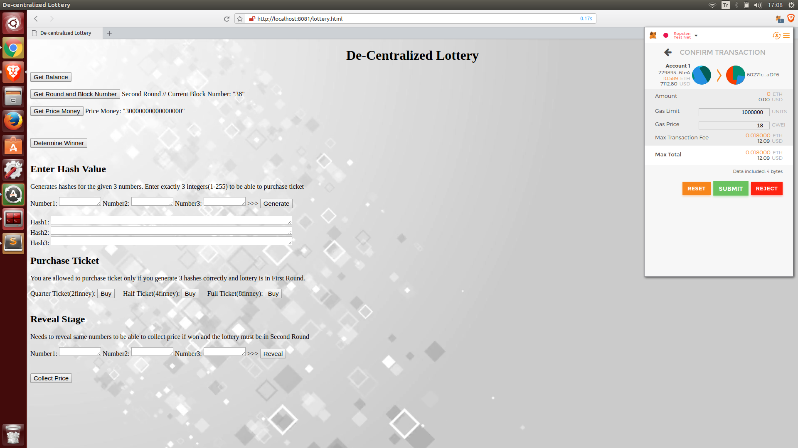   
  </li>
  <li>
    <b>Request of determining winner:</b>    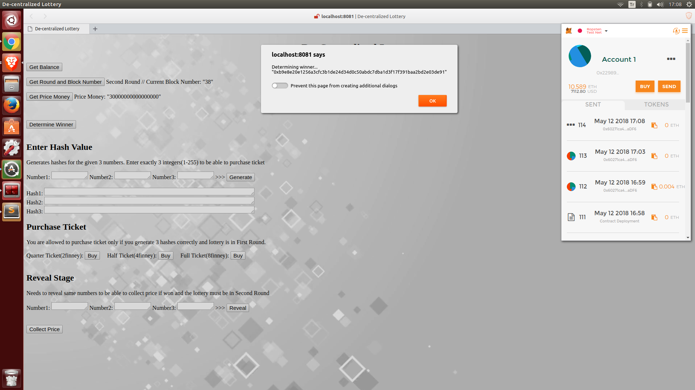   
  </li>
  <li>
    <b>Transcript of successful determine winner:</b>    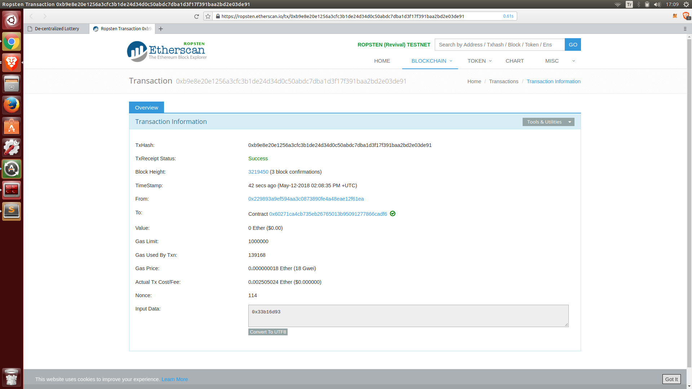   
  </li>
  <li>
    <b>Result of the Lottery after 1st round, Balance is distributed among winners balances. They can collect price any time they want:</b>    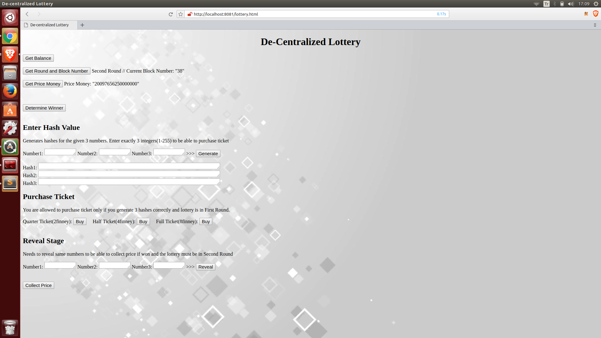   
  </li>
  <li>
    <b>Account1 is one of the winner, requesting collect the price:</b>       
  </li>
  <li>
    <b>Transcript of successful collect price:</b>    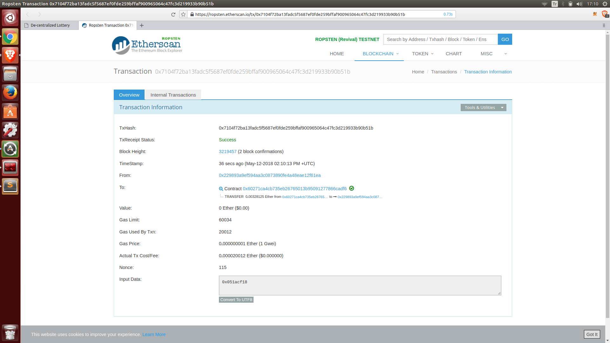   
  </li>
  <li>
    <b>Account1 has half ticket and probably won 3rd price and won less(Account balance's uprised):</b>    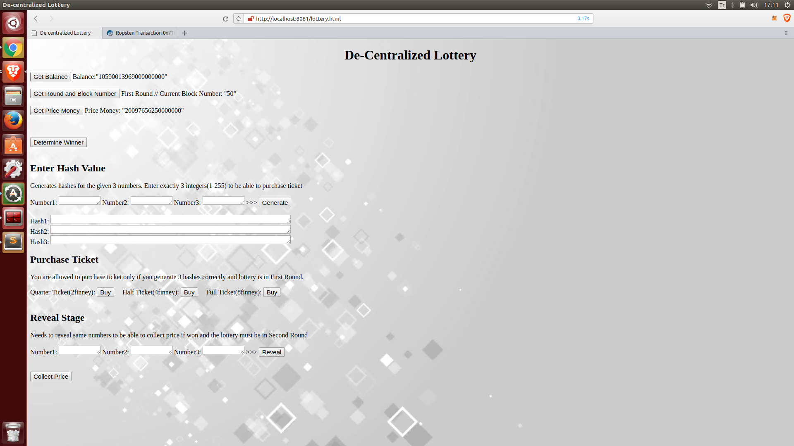   
  </li>
  
</ul>
